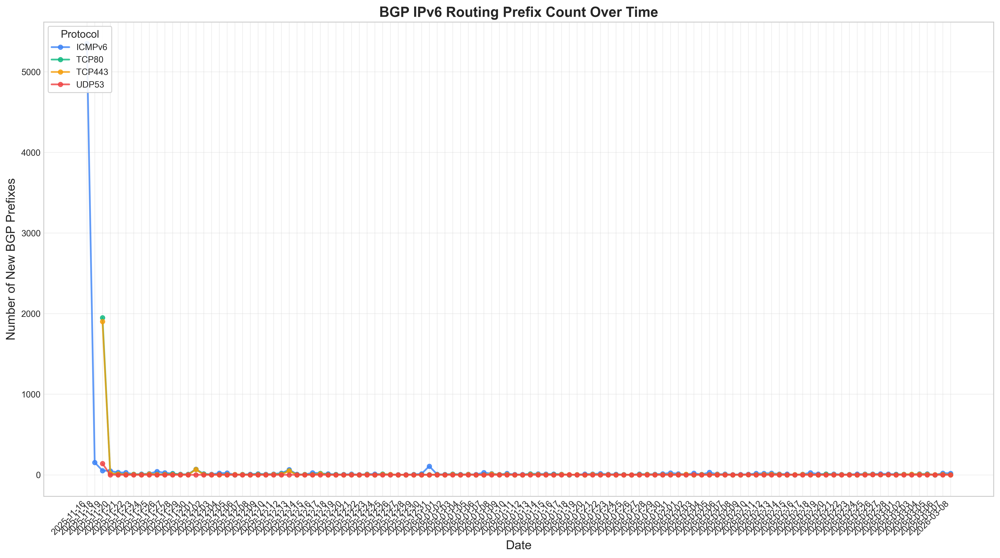
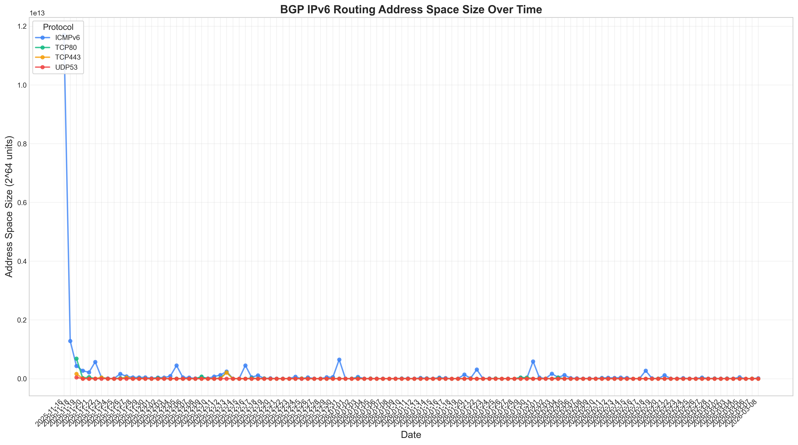
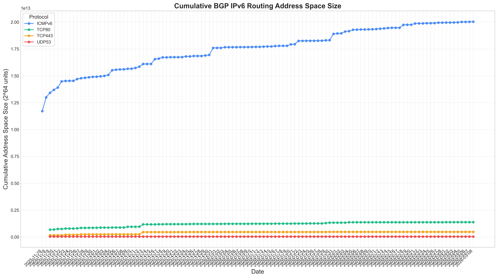
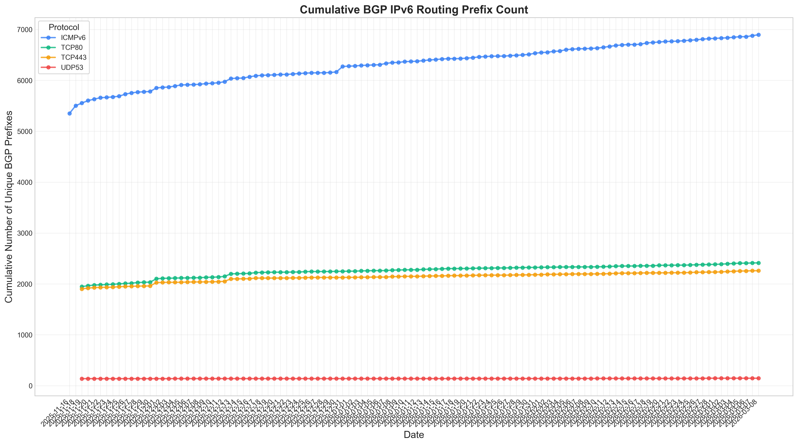

# FRP-watcher

An open-source tool for long-term monitoring of IPv6 Full Response Prefixes (FRP). It performs global IPv6 FRP probing and data collection using mature existing algorithms.

## Analysis Results

### BGP IPv6 Routing Prefix Analysis

We provide comprehensive analysis of BGP-announced IPv6 Fully Responsive Prefixes (FRPs) across different protocols. The following charts show the trends over time:

#### Daily New BGP Prefixes


#### Daily New Address Space Size


#### Cumulative Address Space Size (Deduplicated)


#### Cumulative Prefix Count (Deduplicated)


### Key Features
- **Deduplicated Analysis**: All cumulative metrics are calculated after removing duplicate prefixes
- **Multi-Protocol Support**: Analysis across ICMPv6, TCP/80, TCP/443, and UDP/53 protocols
- **Daily Updates**: Data is updated daily with new measurements
- **Visual Insights**: Clear, professional charts for easy interpretation

### Folder Structure
```plaintext
FRP-watcher/
├── server_Luori/        # FRP results from Luori server
├── server_gungnir/      # FRP results from Gungnir server
├── server_routing/      # BGP-announced FRP datasets
│   ├── ICMPv6/          # BGP FRPs under ICMPv6 probing
│   ├── TCP80/           # BGP FRPs under TCP/80 probing
│   ├── TCP443/          # BGP FRPs under TCP/443 probing
│   ├── UDP53/           # BGP FRPs under UDP/53 probing
│   └── analysis/        # Generated analysis charts and data
├── all_shortest.txt     # Take the shortest among all accumulated FRPs so far.
├── analyze_prefixes.py  # Script for generating analysis charts
└── README.md            # Project documentation
```

## Citation

If you find this paper useful in your research, please cite this paper.

```
@inproceedings{Wei2025gungnir,
  title = {Gungnir: Autoregressive Model for Unified Generation of IPv6 Fully Responsive Prefixes},
  author = {Wei, Chentian and Liu, Ying and He, Lin and Cheng, Daguo and Zhou, Jiasheng},
  booktitle = {Proceedings of the 33rd IEEE International Conference on Network Protocols (ICNP 2025)},
  year = {2025},
  pages = {},
  doi = {},
  address = {Seoul, South Korea},
  date = {September 22-25},
}
```

```
@INPROCEEDINGS{cheng2024luori,
  author={Cheng, Daguo and He, Lin and Wei, Chentian and Yin, Qilei and Jin, Boran and Wang, Zhaoan and Pan, Xiaoteng and Zhou, Sixu and Liu, Ying and Zhang, Shenglin and Tan, Fuchao and Liu, Wenmao},
  booktitle={2024 IEEE 32nd International Conference on Network Protocols (ICNP)}, 
  title={Luori: Active Probing and Evaluation of Internet-Wide IPv6 Fully Responsive Prefixes}, 
  year={2024},
  volume={},
  number={},
  pages={1-12},
  keywords={Protocols;Current measurement;Reinforcement learning;Transforms;Routing;Optimization;IPv6;fully responsive prefix;active probing},
  doi={10.1109/ICNP61940.2024.10858548}}
```